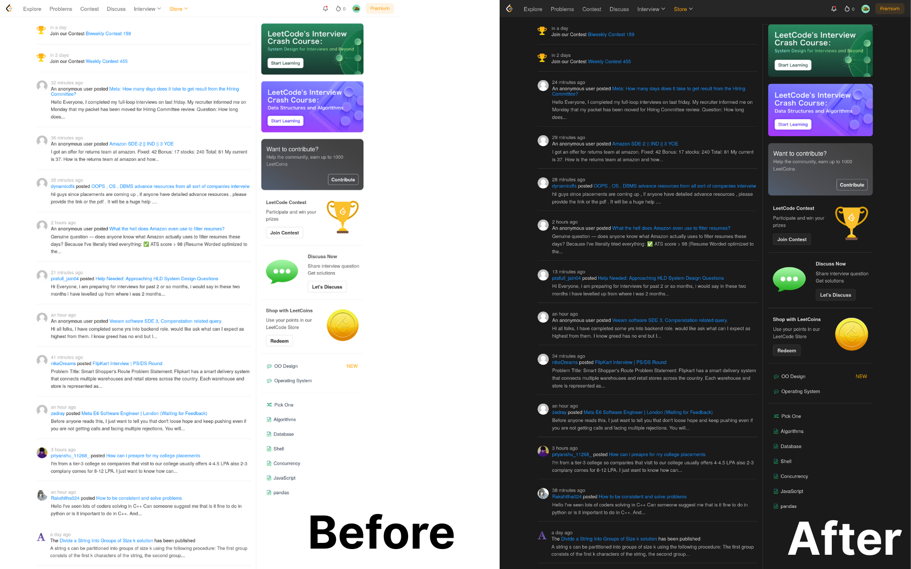

  <h1 align="center">LeetCode Dark Fix</h3>
  

    🌑 Brings dark mode to LeetCode's home page, explore page, and settings page 
     
     
    
    
    
  

## ⭐ About
LeetCode Dark Fix is a userscript that brings dark mode to LeetCode’s home, explore, and settings pages since the official dark mode doesn’t cover these pages yet.
> [!NOTE]
> Teenager? Join [Hack Club](https://hackclub.com)! This script is part of the 17 hour Hack Club event "FIX IT".

## 📥️ Installation
1. Install a userscript manager like [Tampermonkey](https://www.tampermonkey.net/).
- FireFox-based browsers: [Firefox Add-ons](https://addons.mozilla.org/en-US/firefox/addon/tampermonkey/)
- Chromium-based browsers: [Chrome Web Store](https://chromewebstore.google.com/detail/tampermonkey/dhdgffkkebhmkfjojejmpbldmpobfkfo)
3. Open the [GreasyFox](https://greasyfork.org/en/scripts/540164-leetcode-dark-fix) link.
4. Click the green button that says `Install this script`.

## 💾 Demo
Below is the demo for LeetCode's home page. 

